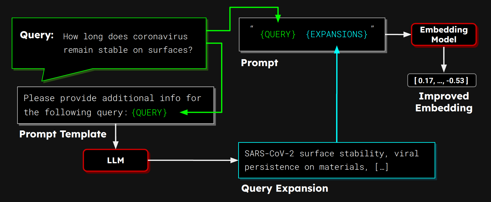
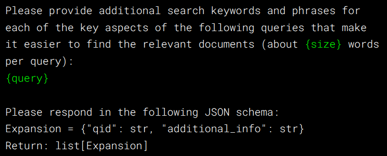
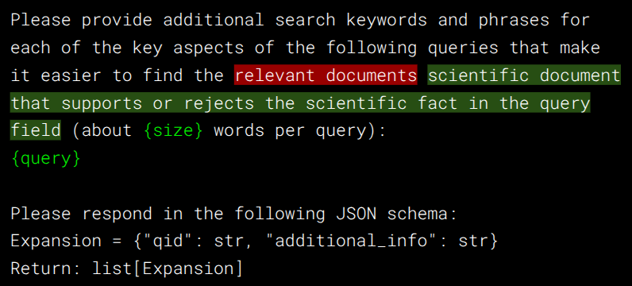

# LLM-Based Query Expansions for Text Embedding Models

This repository contains code for experimenting with LLM-based query expansion

<p>

</p>
<p>
<em>Figure 1: LLM-Based Query Expansion</em>
</p>

## What is LLL-Based Query Expansion?

*Query Expansion* is a technique that automatically expands or reformulates queries to improve information retrieval (IR) systems, i.e., it makes it easier for your search system to find relevant documents.

Query expansion is a very well established in IR.
It is specifically effective in solving problems of keyword-based search systems like BM25 that typical suffer from "zero results" problems: If your search terms don't occur in any document, you don't get any results.
It expands the query with additional relevant terms so that it is less liekly that no document contains any of them.
This usually leads to more results (better recall - less "zero result" situations) and often more accurate relevance judgements (higher precision):
Researchers and practioners have developed a large variety of different methods to find relevant terms for expanding the queries.
Some of the most popular one are:
- **Thesaurus-Based Methods:** A dictionary of synoyms in the domain of the retrieval tasks, called [Thesaurus](https://en.wikipedia.org/wiki/Thesaurus) is used to identify synonymous or related terms that are added to the query string. In the same way knowledge graphs can be used to identify related text values to the terms in the query to expand the query, the class of a term mentioned in the query.
- **Relevance Feedback:** If a use provides feedback which documents are relevant, the IR sytem can expand the query with terms extracted from those documents to find related documents. If no user feedback is available, term from the highest ranked documents can be used instead (pseudo-relevance feedback).
- **Query Logs:** Terms occuring in similar queries in the past can get added to extend the query.
- **User Personalization:** Additional user information, e.g., the users location and preferences, can be added in the form of query terms to idenify more relevant documents for this specific user.

As embedding models capture the semantic of words adding synonyms is not so effective.
Moreover, you never get zero results because embeddings allow you to calculate a similarity score for every document. 
Consequently, the traditional query expansion methods are less popular for embedding models.

LLMs changed this situtation a bit.
While the traditional methods are not used that much, LLM-based query expansion can be indeed effective.
Researchers explored various different LL-based methods, e.g.,using in-context learning (https://arxiv.org/pdf/2305.03653) or progressivly increasing the query expansion based on the first retrieval results (https://arxiv.org/pdf/2406.07136)
In contrast, want to try out how simple expansion methods works with current LLMs and embedding models that can easily be applied to standard use cases and basically any retrieval dataset without much fin-graned tuning of hyperparameters etc.

Figure 1 shows how this works:
1. A query (or a set of queries) is inserted into a prompt template to instruct the LLMs generating query expansions (relevant additional info in the form of keywords / key phrases)
2. The LLMs is applied to generate the expansions based on the prompt.
3. Each query gets concatenated with its expansions and the embedding model encodes this into a representation
4. After that the embedding can be used to match embeddings of documents are this is usally done in dense retrieval systems.


Compared to traditional query expansion methods this technique:
- Abendons users from the need of finding a suitable thresaurus for your retrieval task that has the domain-specific terminology
- It is much more flexibility, allowing you to ajust the prompt to the need of the retrival task (whether you want to find documents, duplicate texts, contadicting statements, etc.) as well as freely decide on the length of


## Apply LLM-Based Query Expansion to Different Retrieval Tasks

To test LMMs for query expansion, we first need to construct a prompt template.
We decided to expand multiple queries at once to reduce the number of LLM calls, although in production, you might want to expand every incomming query directions.
We use the following prompt, which is generic enough to apply it as it is to many different datasets:

<p>

</p>
<p>
<em>Figure 2: Prompt Template to Generate Query Expansions</em>
</p>

It should return a JSON response that maps the query ids to its expansions.
One can configure the target length of the expansions and test this with : 100, 150, and 250 words.

We use the new [Gemini Flash 2.0 (experimental)](https://deepmind.google/technologies/gemini/flash/) model and two models: [jina-embeddings-v3](https://huggingface.co/jinaai/jina-embeddings-v3/) and [all-MiniLM-L6-v2](https://huggingface.co/).

We group 20-50 queries into each request (more queries could exceed the output limit of the LLM).
If JSON reponses are invalid, we shuffle the queries reconstruct the prompt and run the requests again until the LLM returns a valid JSON response that maps the query ids to its expansions. 

For evaluating how well the method works, we apply our method to some of the BeIR datasets that have a low amount of queries.

**SciFact**
| Model     | No Expansion | Gemini-F1.5 (100 words) | Gemini-F1.5 (150 words) | Gemini-F1.5 (250 words) |
|-----------|--------------|-------------------------|-------------------------|-------------------------|
| Jina V3   | 72.74        | 73.39                   | 74.16                   | **74.33**               |
| MiniLM    | 64.51        | **68.72**               | 66.27                   | 68.50                   |

**TRECCOVID**
| Model     | No Expansion | Gemini-F1.5 (100 words) | Gemini-F1.5 (150 words) | Gemini-F1.5 (250 words) |
|-----------|--------------|-------------------------|-------------------------|-------------------------|
| Jina V3   | 77.55        | 76.74                   | 77.12                   | **79.28**               |
| MiniLM    | 47.25        | 67.90                   | **70.18**               | **69.60**               |

**FiQA**
| Model     | No Expansion | Gemini-F1.5 (100 words) | Gemini-F1.5 (150 words) | Gemini-F1.5 (250 words) |
|-----------|--------------|-------------------------|-------------------------|-------------------------|
| Jina V3   | 47.34        | **47.76**               | 46.03                   | 47.34                   |
| MiniLM    | **36.87**    | 33.96                   | 32.60                   | 31.84                   |

**NFCorpus**
| Model     | No Expansion | Gemini-F1.5 (100 words) | Gemini-F1.5 (150 words) | Gemini-F1.5 (250 words) |
|-----------|--------------|-------------------------|-------------------------|-------------------------|
| Jina V3   | 36.46        |  **40.619**             | 39.633                  | 39.196                  |
| MiniLM    | 31.59        | **33.76**               | **33.76**               | 33.35                   |

**Touche2020**
| Model     | No Expansion | Gemini-F1.5 (100 words) | Gemini-F1.5 (150 words) | Gemini-F1.5 (250 words) |
|-----------|--------------|-------------------------|-------------------------|-------------------------|
| Jina V3   |         |                |                    |                    |
| MiniLM    | 16.90        | **25.31**               | 23.52                   | 23.23                   |

Touche2020


TODO describe results.

### Task-Specific Prompt Expansion

While the method with the prompt above usually leads to improvements, it also degrates the performance for some datasets. This might be due to a too generic prompt which lead to expansions that do not perfectly fit to the intended retrieval task and embedding models.
So we want to test whether using more task-specific prompts lead to better result and therefore constructed the following refined prompts for SciFact and FiQA: 



**SciFact - Task-Specific Prompt for Expansion**
| Model     | No Expansion | Gemini-F1.5 (100 words) | Gemini-F1.5 (150 words) | Gemini-F1.5 (250 words) |
|-----------|--------------|-------------------------|-------------------------|-------------------------|
| Jina V3   | 72.74        | 74.15 (+0.76)           | 74.50 (+0.34)           | 75.07 (+0.74)           |
| MiniLM    | 64.508       | 68.32 (-0.40)           | **69.07 (+2.80)**       | 68.84 (+0.34)           |

TODO do this for FiQA as well.

One can see that the average improvement for the task-specific prompts is higher.

## What are the Advantages and Disadvantages of LLM-Based Query Expansion

Our experimental results show that query expansion with LLMs can indeed improve the retrieval performance of embedding models.
Specifically they are helpful
- If your model is able to comprehent long queries well
- If you are not happy with the retrival performance
- If retrieval performance is more important than speed

## Further Directions

- Using other retrieval models like re-ranking models
- Extend the Documents instead of the queries or prepend a summary of the document before embedding (many embedding models have limited context length or focus on the beginning of the document)
- Instead of using LLMs, one might want to use techniques that are faster and cheaper.
- Experiment with the prompting, e.g., define clearly which format should the expansions have: whether to include topics, questions, synonyms and how many, and experiment with the differnt prompt variations.

## Conclusion

TODO summarize, add some useful reference toother articles, Jina API, LLMs etc.

## How to Run Query Expansion Experiments and Reproduce the Results?

The `llm_query_expansion` tool in this repository serves as a CLI tool that has two sub commands:
- `expand`: for creating query expansions for different retrieval tasks of the [MTEB benchmark](https://github.com/embeddings-benchmark/mteb) and store them in a file.
- `evaluate`: for evaluating the tasks with different query expansions (or without any query expansion)

You can be install the tool with `pip install .`

### Generate Expansions

We provided a set of expanded queries in the the `query_expansions` folder of this repository that can be used out of the box.

If you want to create custom expansions or expand queries for other tasks, you can use the `expand` command. 
This requires getting a [Gemini API key](https://aistudio.google.com/apikey) (at the moment you can get a key for free for up to 1,500 requests per day) and setting it as environment variable:

```sh
export GEMINI_API_KEY={YOUR_KEY}
```

To apply query expansion to a specific MTEB Retrieval task, you can then call:

```sh
python3 -m llm_query_expansion expand --task {TASK_NAME} --expansion-size {NUMBER_OF_WORDS} --batch-size {QUERIES_PER_LLM_REQUEST} --output-file query_expansions/{FILENAME}
```

### Evalute Models With and Without Expanded Queries

To run evaluations with expanded queries, you can use the file  

```sh
python3 -m llm_query_expansion evaluate  --task {TASK_NAME} --expansions-file query_expansions/{FILE_NAME} --model-name {MODEL_NAME} --output-folder {RESULTS_FOLDER_NAME}
```

